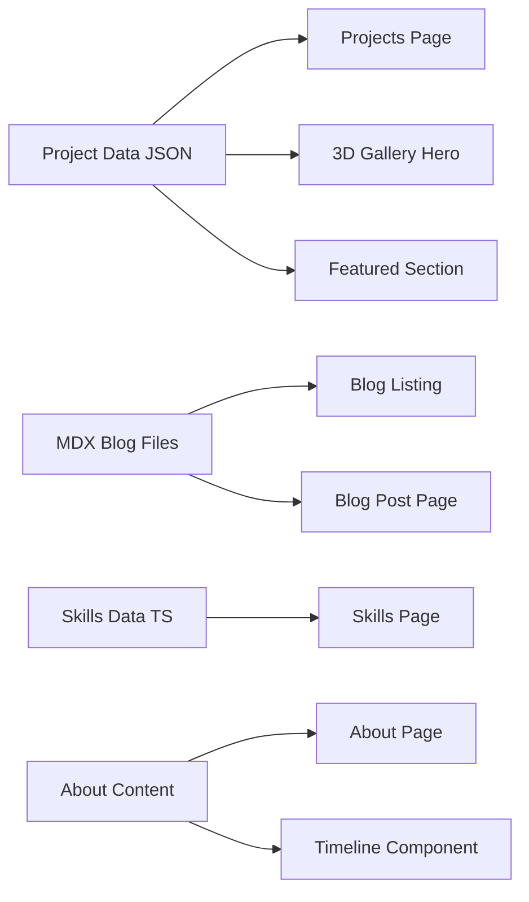
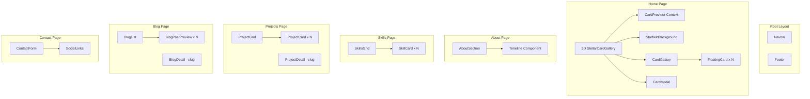
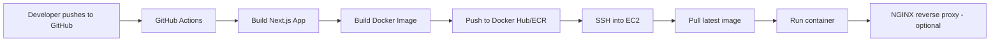

# Cloud/DevOps Journey Portfolio - Architecture Plan

## Overview

A Next.js portfolio website for a career-switcher into Cloud/DevOps Engineering. Features a 3D Stellar Card Gallery as the hero section (showcasing projects), plus pages for About, Skills, Timeline, Blog, and Contact. Dockerized and deployed via GitHub Actions to EC2.

## Tech Stack

| Layer | Technology |
|-------|-----------|
| **Framework** | Next.js 14+ (App Router) with TypeScript |
| **Styling** | Tailwind CSS + shadcn/ui components |
| **3D Rendering** | Three.js, @react-three/fiber, @react-three/drei |
| **Icons** | lucide-react, devicons (for cloud/DevOps tools) |
| **Blog** | MDX (next-mdx-remote or @next/mdx) |
| **Containerization** | Docker, docker-compose |
| **CI/CD** | GitHub Actions |
| **Deployment** | AWS EC2 |

## Project Structure

```
web-yassir/
├── public/
│   ├── images/
│   │   ├── projects/       # Project screenshots
│   │   ├── skills/         # Skill icons/logos
│   │   └── profile/        # Profile photos
│   └── fonts/              # Custom fonts (optional)
├── src/
│   ├── app/
│   │   ├── layout.tsx      # Root layout (navbar, footer, providers)
│   │   ├── page.tsx        # Home page (Hero with 3D Gallery)
│   │   ├── about/
│   │   │   └── page.tsx    # About / Journey page
│   │   ├── skills/
│   │   │   └── page.tsx    # Skills & Technologies page
│   │   ├── projects/
│   │   │   ├── page.tsx    # Projects listing
│   │   │   └── [slug]/
│   │   │       └── page.tsx # Individual project detail
│   │   ├── blog/
│   │   │   ├── page.tsx    # Blog listing
│   │   │   └── [slug]/
│   │   │       └── page.tsx # Individual blog post
│   │   ├── contact/
│   │   │   └── page.tsx    # Contact page
│   │   └── globals.css     # Global styles + Tailwind
│   ├── components/
│   │   ├── ui/             # shadcn/ui components
│   │   │   ├── button.tsx
│   │   │   ├── card.tsx
│   │   │   ├── badge.tsx
│   │   │   └── ... (other shadcn components)
│   │   ├── layout/
│   │   │   ├── navbar.tsx
│   │   │   ├── footer.tsx
│   │   │   └── mobile-nav.tsx
│   │   ├── sections/
│   │   │   ├── hero-section.tsx       # Wrapper for 3D gallery
│   │   │   ├── skills-grid.tsx
│   │   │   ├── project-card.tsx
│   │   │   ├── timeline.tsx
│   │   │   └── contact-form.tsx
│   │   └── 3d/
│   │       ├── stellar-card-gallery.tsx  # Main 3D gallery (from Background.md)
│   │       ├── starfield-background.tsx
│   │       ├── floating-card.tsx
│   │       ├── card-galaxy.tsx
│   │       ├── card-modal.tsx
│   │       └── card-context.tsx
│   ├── content/
│   │   ├── blog/            # MDX blog posts
│   │   │   ├── first-post.mdx
│   │   │   └── ...
│   │   └── projects/        # Project data (JSON or MDX)
│   │       └── projects.ts
│   ├── lib/
│   │   ├── utils.ts         # shadcn utility (cn function)
│   │   ├── blog.ts          # MDX parsing utilities
│   │   └── constants.ts     # Site-wide constants
│   └── types/
│       └── index.ts         # TypeScript type definitions
├── content/
│   ├── blog/                # Alternative: MDX files at root level
│   └── projects/
├── docker/
│   ├── Dockerfile
│   └── docker-compose.yml
├── .github/
│   └── workflows/
│       └── deploy.yml       # GitHub Actions CI/CD
├── next.config.js
├── tailwind.config.ts
├── tsconfig.json
└── package.json
```

## Page Architecture & Routing

```mermaid
graph TD
    A[Root Layout layout.tsx] --> B[Navbar]
    A --> C[Main Content]
    A --> D[Footer]
    
    C --> E[/ - Home Page]
    C --> F[/about - About Page]
    C --> G[/skills - Skills Page]
    C --> H[/projects - Projects Listing]
    H --> I[/projects/slug - Project Detail]
    C --> J[/blog - Blog Listing]
    J --> K[/blog/slug - Blog Post]
    C --> L[/contact - Contact Page]
    
    E --> M[3D Stellar Card Gallery Hero]
    E --> N[Featured Projects Preview]
    E --> O[Quick Stats / Highlights]
```

## Data Flow



## Component Tree



## 3D Gallery Card Data (Projects)

The 3D gallery cards will represent projects your friend has built during their learning journey. Example project data structure:

```typescript
interface Project {
  id: string;
  title: string;
  description: string;
  imageUrl: string;        // Screenshot or diagram
  tags: string[];          // e.g., ["AWS", "Docker", "Terraform"]
  category: "cloud" | "devops" | "monitoring" | "ci-cd";
  githubUrl?: string;
  liveUrl?: string;
  date: string;
  highlights: string[];
}
```

Example projects to feature:
1. **VPC Architecture Design** - Custom VPC with public/private subnets, NAT Gateway, bastion host
2. **Auto-Scaling Web App** - EC2 Auto Scaling Group + ALB setup
3. **S3 Static Website** - Hosted static site with CloudFront CDN
4. **RDS Database Setup** - MySQL/PostgreSQL on RDS with security best practices
5. **Serverless API** - Lambda + API Gateway + DynamoDB
6. **Dockerized Microservices** - Multi-container app with docker-compose
7. **CI/CD Pipeline** - GitHub Actions workflow deploying to EC2
8. **Monitoring Stack** - Grafana + Prometheus + Node Exporter dashboard

## Color Scheme (Dark Theme)

| Token | Value | Usage |
|-------|-------|-------|
| `background` | `#000000` / `#0a0a0a` | Page backgrounds |
| `card-bg` | `#1F2121` | Card backgrounds |
| `primary` | `#31b8c6` (teal/cyan) | Accent, buttons, links |
| `primary-glow` | `rgba(49, 184, 198, 0.5)` | Glow effects |
| `text-primary` | `#ffffff` | Main text |
| `text-secondary` | `#a0a0a0` | Muted text |
| `border` | `rgba(255,255,255,0.1)` | Subtle borders |

## Implementation Phases

### Phase 1: Project Scaffolding
- Initialize Next.js project with `create-next-app`
- Install dependencies: three, @react-three/fiber, @react-three/drei, lucide-react
- Set up shadcn/ui with `npx shadcn@latest init`
- Configure Tailwind with custom theme colors
- Set up TypeScript strict mode

### Phase 2: Core Configuration
- Create root layout with Navbar and Footer
- Set up routing structure (all page files)
- Create global CSS with dark theme variables
- Set up utility functions and constants

### Phase 3: 3D Stellar Card Gallery (Hero)
- Refactor the 3D gallery component from Background.md
- Replace placeholder card data with project data
- Adapt card images to use project screenshots (Unsplash fallbacks)
- Ensure proper loading states and error boundaries

### Phase 4: About Page
- Career change story section
- Professional bio
- Journey timeline component (visual timeline of learning milestones)

### Phase 5: Skills Page
- Grid layout of skills with icons
- Categories: Cloud (AWS), Containers (Docker), CI/CD, Monitoring, Infrastructure as Code
- Proficiency indicators (beginner → expert)

### Phase 6: Projects Page
- Project listing with filter by category
- Individual project detail pages
- Links to GitHub repos and live demos

### Phase 7: Blog System
- MDX setup with next-mdx-remote or @next/mdx
- Blog listing page with post previews
- Individual blog post pages with MDX rendering
- Sample blog posts about learning journey

### Phase 8: Contact Page
- Contact form (or mailto link)
- Social links (LinkedIn, GitHub, Twitter)
- Optional: Email service integration (EmailJS, Resend)

### Phase 9: Navigation & Footer
- Responsive navbar with mobile hamburger menu
- Active route highlighting
- Footer with social links and copyright

### Phase 10: Dockerization
- Multi-stage Dockerfile for Next.js
- docker-compose.yml for local development
- .dockerignore for optimized builds

### Phase 11: GitHub Actions CI/CD
- Build and test workflow
- Docker image build and push to Docker Hub / ECR
- Deploy to EC2 via SSH

### Phase 12: Final Polish
- SEO metadata (next-seo or generateMetadata)
- Responsive testing across devices
- Performance optimization (image optimization, lazy loading)
- Accessibility improvements

## Dependencies

```json
{
  "dependencies": {
    "next": "^14.x",
    "react": "^18.x",
    "react-dom": "^18.x",
    "three": "^0.160.x",
    "@react-three/fiber": "^8.x",
    "@react-three/drei": "^9.x",
    "lucide-react": "^0.x",
    "next-mdx-remote": "^4.x",
    "class-variance-authority": "^0.7.x",
    "clsx": "^2.x",
    "tailwind-merge": "^2.x",
    "tailwindcss-animate": "^1.x"
  },
  "devDependencies": {
    "typescript": "^5.x",
    "@types/three": "^0.x",
    "@types/node": "^20.x",
    "@types/react": "^18.x",
    "tailwindcss": "^3.x",
    "postcss": "^8.x",
    "autoprefixer": "^10.x"
  }
}
```

## Deployment Architecture


